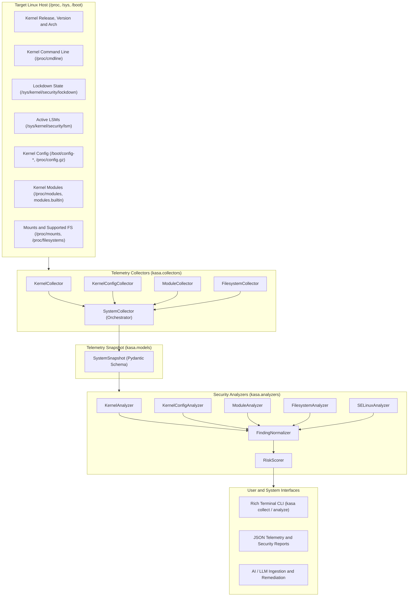

<h1>KASA: Linux Kernel Attack Surface Analyzer</h1>

<p>
  <a href="https://www.python.org/downloads/"></a>
  <a href="LICENSE"></a>
  <a href="https://github.com/astral-sh/ruff"></a>
  <a href="http://mypy-lang.org/"></a>
  <a href="tests/"></a>
</p>

<p>
  <strong>KASA</strong> (Kernel Attack Surface Analyzer) is an AI-assisted Linux kernel security analysis framework designed to inspect, collect, and assess kernel attack surface exposure, hardening controls, and security posture across Linux systems.
</p>

<p>
  It combines non-invasive user space telemetry collectors, deterministic security analyzers, schema-validated evidence models, and risk scoring engines into an extensible tool for security audits and automated AI workflows.
</p>

<hr />

<h2>Table of Contents</h2>

<ul>
  <li><a href="#overview">Overview</a></li>
  <li><a href="#architecture">Architecture</a></li>
  <li><a href="#detailed-installation-guide">Detailed Installation Guide</a>
    <ul>
      <li><a href="#prerequisites">Prerequisites</a></li>
      <li><a href="#step-by-step-installation">Step-by-Step Installation</a></li>
      <li><a href="#development-installation">Development Installation</a></li>
      <li><a href="#troubleshooting-and-verification">Troubleshooting and Verification</a></li>
    </ul>
  </li>
  <li><a href="#things-we-implemented">Things We Implemented</a>
    <ul>
      <li><a href="#1-telemetry-collectors">1. Telemetry Collectors</a></li>
      <li><a href="#2-deterministic-security-analyzers">2. Deterministic Security Analyzers</a></li>
      <li><a href="#3-evidence-and-finding-schemas-pydantic-v2">3. Evidence and Finding Schemas (Pydantic v2)</a></li>
      <li><a href="#4-risk-scoring-and-rating-engine">4. Risk Scoring and Rating Engine</a></li>
      <li><a href="#5-command-line-interface-cli">5. Command-Line Interface (CLI)</a></li>
      <li><a href="#6-testing-and-quality-assurance">6. Testing and Quality Assurance</a></li>
    </ul>
  </li>
  <li><a href="#security-rules-and-findings-catalog">Security Rules and Findings Catalog</a></li>
  <li><a href="#usage-guide-and-examples">Usage Guide and Examples</a>
    <ul>
      <li><a href="#1-inspect-kernel-telemetry-collect">1. Inspect Kernel Telemetry (collect)</a></li>
      <li><a href="#2-run-security-hardening-assessment-analyze">2. Run Security Hardening Assessment (analyze)</a></li>
      <li><a href="#3-export-evidence-and-analysis-to-json">3. Export Evidence and Analysis to JSON</a></li>
      <li><a href="#4-display-version-version">4. Display Version (version)</a></li>
    </ul>
  </li>
  <li><a href="#project-directory-structure">Project Directory Structure</a></li>
  <li><a href="#development-linting-and-type-checking">Development, Linting and Type Checking</a></li>
  <li><a href="#contributing">Contributing</a></li>
  <li><a href="#license">License</a></li>
</ul>

<hr />

<h2 id="overview">Overview</h2>

<p>
  Linux systems expose extensive attack surfaces through runtime kernel modules, compile-time configuration choices, filesystem mount options, and runtime kernel flags. KASA automates the assessment of these security boundaries by gathering deterministic telemetry directly from standard Linux interfaces (/proc, /sys, /boot) and comparing the host state against established security baselines.
</p>

<h3 id="design-principles">Design Principles</h3>

<ul>
  <li><strong>Zero Workload Impact</strong>: Completely read-only and non-invasive; requires no kernel modules, kernel patches, or intrusive hooks.</li>
  <li><strong>Strict Data Integrity</strong>: All collected telemetry and security findings are modeled as immutable, strongly typed Pydantic v2 schemas with extra parameters forbidden.</li>
  <li><strong>Deterministic Evaluation</strong>: Security analyzers produce reproducible findings with full traceability back to raw evidence keys and source paths.</li>
  <li><strong>AI and Automation Readiness</strong>: Structured JSON exports seamlessly integrate with downstream LLM-assisted remediation pipelines, SIEM ingest, and CI/CD security validation.</li>
</ul>

<hr />

<h2 id="architecture">Architecture</h2>



<hr />

<h2 id="detailed-installation-guide">Detailed Installation Guide</h2>

<h3 id="prerequisites">Prerequisites</h3>

<p>Before installing KASA, ensure your system meets the following requirements:</p>

<ul>
  <li><strong>Operating System</strong>: Linux (x86_64, aarch64, riscv64, or any standard POSIX Linux distribution).</li>
  <li><strong>Python</strong>: Version 3.12 or higher (Python 3.12, 3.13, and 3.14 supported).</li>
  <li><strong>Git</strong>: Installed and configured on your system.</li>
  <li><strong>Access Permissions</strong>: Standard user permissions are sufficient for most collectors. Accessing /boot/config-* or specific /sys/kernel/security entries may benefit from elevated permissions depending on host security settings.</li>
</ul>

<h3 id="step-by-step-installation">Step-by-Step Installation</h3>

<h4 id="1-clone-the-repository">1. Clone the Repository</h4>
<p>Clone the project repository from GitHub to your local machine:</p>

```bash
git clone https://github.com/DHARSHAN-14/KASA.git
cd KASA
```

<h4 id="2-create-and-activate-a-virtual-environment">2. Create and Activate a Virtual Environment</h4>
<p>Create an isolated virtual environment named .venv and activate it:</p>

```bash
python3 -m venv .venv
source .venv/bin/activate
```

<p>Verify your active Python interpreter:</p>

```bash
which python
python --version
```

<h4 id="3-install-kasa-in-standard-or-editable-mode">3. Install KASA in Standard or Editable Mode</h4>
<p>Install the package in editable mode so code changes take effect immediately:</p>

```bash
pip install -e .
```

<p>This installs KASA along with its primary dependencies:</p>
<ul>
  <li><code>pydantic</code> (Schema modeling and validation)</li>
  <li><code>pydantic-settings</code> (Settings management)</li>
  <li><code>typer</code> (CLI command framework)</li>
  <li><code>rich</code> (Terminal formatting and tables)</li>
</ul>

<h3 id="development-installation">Development Installation</h3>

<p>To install development, testing, and linting tools alongside KASA:</p>

```bash
pip install -e ".[dev]"
```

<p>This installs testing and quality tools:</p>
<ul>
  <li><code>pytest</code> (Test execution framework)</li>
  <li><code>pytest-cov</code> (Test coverage reporting)</li>
  <li><code>mypy</code> (Static type checker)</li>
  <li><code>ruff</code> (Linter and code formatter)</li>
</ul>

<h3 id="troubleshooting-and-verification">Troubleshooting and Verification</h3>

<p>Verify the installation by running the CLI help command:</p>

```bash
kasa --help
```

<p>Output:</p>

```text
Usage: kasa [OPTIONS] COMMAND [ARGS]...

AI-assisted Linux Kernel Attack Surface Analyzer.

Options:
  --install-completion  Install completion for the current shell.
  --show-completion     Show completion for the current shell.
  --help                Show this message and exit.

Commands:
  version  Display the KASA version.
  collect  Collect Linux kernel attack-surface evidence.
  analyze  Analyze collected evidence for security findings.
```

<hr />

<h2 id="things-we-implemented">Things We Implemented</h2>

<p>KASA is structured into decoupled domain collectors, strongly typed Pydantic models, deterministic rule analyzers, and automated risk scoring engines. Below is a detailed breakdown of all implemented components:</p>

<h3 id="1-telemetry-collectors">1. Telemetry Collectors</h3>

<p>Located in <code>src/kasa/collectors/</code>, these modules extract read-only security telemetry across Linux subsystems:</p>

<ul>
  <li>
    <strong>KernelCollector</strong> (<code>src/kasa/collectors/kernel.py</code>):
    <ul>
      <li>Extracts core kernel metadata: release, version, machine architecture, node, system name, and processor.</li>
      <li>Reads and parses boot arguments from <code>/proc/cmdline</code>.</li>
      <li>Inspects <code>/sys/kernel/security/lockdown</code> to identify active lockdown mode (parses <code>none</code>, <code>integrity</code>, or <code>confidentiality</code> from bracketed status output).</li>
      <li>Reads <code>/sys/kernel/security/lsm</code> to extract ordered active Linux Security Modules (e.g., lockdown, capability, yama, selinux, bpf, landlock, ipe, ima, evm).</li>
      <li>Inspects <code>/sys/fs/selinux/enforce</code> and <code>/sys/fs/selinux/policyvers</code> to determine runtime SELinux enforcement mode (enforcing vs permissive) and policy version.</li>
      <li>Collects runtime IMA (Integrity Measurement Architecture) evidence from <code>/sys/kernel/security/ima</code> including policy availability, runtime measurement count, violations count, and boot parameters.</li>
      <li>Collects runtime EVM (Extended Verification Module) state from <code>/sys/kernel/security/evm</code> including status flags and initialization state.</li>
      <li>Collects runtime IPE (Integrity Policy Enforcement) state from <code>/sys/kernel/security/ipe</code> including enforce mode, audit state, and deployed policies.</li>
      <li>Handles missing files or permission restrictions gracefully using typed status indicators (AVAILABLE, UNAVAILABLE, ERROR).</li>
    </ul>
  </li>
  <li>
    <strong>KernelConfigCollector</strong> (<code>src/kasa/collectors/config.py</code>):
    <ul>
      <li>Discovers active kernel build configuration across multiple fallback sources:
        <ol>
          <li><code>/proc/config.gz</code></li>
          <li><code>/boot/config-&lt;release&gt;</code></li>
          <li><code>/lib/modules/&lt;release&gt;/build/.config</code></li>
        </ol>
      </li>
      <li>Performs on-the-fly decompression for gzip-compressed configuration files.</li>
      <li>Parses kernel configuration syntax into normalized key-value pairs, converting enabled options (<code>CONFIG_OPTION=y</code> or string values), module options (<code>CONFIG_OPTION=m</code>), and disabled options (<code>CONFIG_OPTION is not set</code> mapped to <code>"n"</code>).</li>
    </ul>
  </li>
  <li>
    <strong>ModuleCollector</strong> (<code>src/kasa/collectors/modules.py</code>):
    <ul>
      <li>Parses <code>/proc/modules</code> to inventory loaded kernel modules with name, size in memory, reference count, and dependency lists.</li>
      <li>Reads <code>/lib/modules/&lt;release&gt;/modules.builtin</code> to catalog built-in kernel modules.</li>
    </ul>
  </li>
  <li>
    <strong>FilesystemCollector</strong> (<code>src/kasa/collectors/filesystem.py</code>):
    <ul>
      <li>Parses <code>/proc/mounts</code> into structured mount entries capturing source device, mount point, filesystem type, and option flags (e.g., <code>rw</code>, <code>ro</code>, <code>noexec</code>, <code>nosuid</code>, <code>nodev</code>).</li>
      <li>Reads <code>/proc/filesystems</code> to list all filesystem drivers supported by the running kernel.</li>
    </ul>
  </li>
  <li>
    <strong>SysctlCollector</strong> (<code>src/kasa/collectors/sysctl.py</code>):
    <ul>
      <li>Provides interfaces for reading and evaluating runtime kernel sysctl parameters under <code>/proc/sys</code>.</li>
    </ul>
  </li>
  <li>
    <strong>SystemCollector</strong> (<code>src/kasa/collectors/system.py</code>):
    <ul>
      <li>Acts as the aggregate orchestrator, executing all domain collectors and assembling a unified <code>SystemSnapshot</code>.</li>
    </ul>
  </li>
</ul>

<h3 id="2-deterministic-security-analyzers">2. Deterministic Security Analyzers</h3>

<p>Located in <code>src/kasa/analyzers/</code>, these engines assess collected evidence against hardening baselines:</p>

<ul>
  <li>
    <strong>KernelAnalyzer</strong> (<code>src/kasa/analyzers/kernel.py</code>):
    <ul>
      <li><strong>KASA-KERNEL-001</strong>: Evaluates kernel lockdown state. Emits a finding when lockdown mode is <code>none</code>, including boot command line context and remediation advice.</li>
    </ul>
  </li>
  <li>
    <strong>KernelConfigAnalyzer</strong> (<code>src/kasa/analyzers/config.py</code>):
    <ul>
      <li><strong>KASA-CONFIG-RANDOMIZE_BASE</strong>: Validates Kernel Address Space Layout Randomization (KASLR). Flags when disabled.</li>
      <li><strong>KASA-CONFIG-STACKPROTECTOR</strong>: Validates kernel stack protection mechanisms.</li>
      <li><strong>KASA-CONFIG-STRICT_KERNEL_RWX</strong>: Validates Write XOR Execute (W^X) memory permissions for kernel code and data.</li>
      <li><strong>KASA-CONFIG-STRICT_MODULE_RWX</strong>: Validates Write XOR Execute (W^X) memory permissions for loadable module code and data.</li>
    </ul>
  </li>
  <li>
    <strong>ModuleAnalyzer</strong> (<code>src/kasa/analyzers/modules.py</code>):
    <ul>
      <li><strong>KASA-MODULE-001</strong>: Inventories active loadable modules to quantify exposure.</li>
      <li><strong>KASA-MODULE-002</strong>: Checks module signature enforcement by inspecting <code>CONFIG_MODULE_SIG_FORCE</code> and kernel boot argument <code>module.sig_enforce=1</code>.</li>
    </ul>
  </li>
  <li>
    <strong>FilesystemAnalyzer</strong> (<code>src/kasa/analyzers/filesystem.py</code>):
    <ul>
      <li><strong>KASA-FS-001</strong>: Checks sensitive mount points such as <code>/tmp</code> for the presence of the <code>noexec</code> mount option.</li>
    </ul>
  </li>
  <li>
    <strong>SELinuxAnalyzer</strong> (<code>src/kasa/analyzers/selinux.py</code>):
    <ul>
      <li><strong>KASA-SELINUX-001</strong>: Evaluates runtime SELinux enforcement mode. Emits a finding when SELinux is active in permissive mode rather than enforcing.</li>
    </ul>
  </li>
  <li>
    <strong>FindingNormalizer</strong> (<code>src/kasa/analyzers/normalize.py</code>):
    <ul>
      <li>Deduplicates and standardizes security findings across multiple analyzers.</li>
    </ul>
  </li>
</ul>

<h3 id="3-evidence-and-finding-schemas-pydantic-v2">3. Evidence and Finding Schemas (Pydantic v2)</h3>

<p>Located in <code>src/kasa/models/</code>:</p>

<ul>
  <li><strong>EvidenceItem and EvidenceSource</strong> (<code>evidence.py</code>): Models raw evidence data, source file path, collection timestamp, status, and error messages.</li>
  <li><strong>Finding and FindingEvidence</strong> (<code>finding.py</code>): Models security findings with unique ID, title, description, severity level (INFO, LOW, MEDIUM, HIGH, CRITICAL), category, supporting evidence, and recommendation.</li>
  <li><strong>SystemSnapshot</strong> (<code>snapshot.py</code>): Root data model aggregating kernel info, configuration options, module inventory, filesystem mounts, and collection diagnostics.</li>
  <li><strong>AnalysisResult</strong> (<code>analysis.py</code>): Output model containing normalized security findings and total count.</li>
</ul>

<h3 id="4-risk-scoring-and-rating-engine">4. Risk Scoring and Rating Engine</h3>

<p>Located in <code>src/kasa/analyzers/risk.py</code>:</p>

<p>Calculates an objective risk score by summing points assigned to each finding severity:</p>

<table>
  <thead>
    <tr>
      <th>Severity</th>
      <th>Points</th>
    </tr>
  </thead>
  <tbody>
    <tr>
      <td><strong>CRITICAL</strong></td>
      <td>+50</td>
    </tr>
    <tr>
      <td><strong>HIGH</strong></td>
      <td>+30</td>
    </tr>
    <tr>
      <td><strong>MEDIUM</strong></td>
      <td>+15</td>
    </tr>
    <tr>
      <td><strong>LOW</strong></td>
      <td>+5</td>
    </tr>
    <tr>
      <td><strong>INFO</strong></td>
      <td>+0</td>
    </tr>
  </tbody>
</table>

<p>The total score maps to an overall system rating:</p>
<ul>
  <li><strong>CRITICAL</strong>: Score of 50 or higher</li>
  <li><strong>HIGH</strong>: Score from 30 to 49</li>
  <li><strong>MEDIUM</strong>: Score from 15 to 29</li>
  <li><strong>LOW</strong>: Score below 15</li>
</ul>

<h3 id="5-command-line-interface-cli">5. Command-Line Interface (CLI)</h3>

<p>Implemented in <code>src/kasa/cli.py</code> using Typer and Rich:</p>

<ul>
  <li><code>kasa version</code>: Displays the installed package version.</li>
  <li><code>kasa collect</code>: Gathers kernel evidence and displays formatted summary metrics. Supports <code>--json</code> for stdout streaming and <code>--output / -o &lt;file&gt;</code> to save snapshot files.</li>
  <li><code>kasa analyze</code>: Executes collectors and analyzers, computes risk score and rating, and outputs formatted findings with recommendations. Supports <code>--json</code> for structured export.</li>
</ul>

<h3 id="6-testing-and-quality-assurance">6. Testing and Quality Assurance</h3>

<p>The codebase includes 104 comprehensive unit tests across <code>tests/</code> verifying:</p>
<ul>
  <li>CLI command invocations and argument parsing (<code>test_cli.py</code>)</li>
  <li>Kernel telemetry, lockdown, LSM, IMA, EVM, and IPE extraction (<code>test_kernel.py</code>)</li>
  <li>Runtime SELinux enforcement mode extraction and analysis (<code>test_selinux.py</code>)</li>
  <li>Kernel configuration discovery and decompression (<code>test_config.py</code>)</li>
  <li>Module collection and signature enforcement (<code>test_modules.py</code>)</li>
  <li>Filesystem mount inspection (<code>test_filesystem.py</code>)</li>
  <li>Analyzer logic and finding normalization (<code>test_analyzers.py</code>, <code>test_normalize.py</code>)</li>
  <li>Risk scoring calculations (<code>test_risk.py</code>)</li>
  <li>End-to-end system collection workflow (<code>test_system.py</code>, <code>test_analysis.py</code>)</li>
</ul>

<hr />

<h2 id="security-rules-and-findings-catalog">Security Rules and Findings Catalog</h2>

<table>
  <thead>
    <tr>
      <th>Rule ID</th>
      <th>Category</th>
      <th>Severity</th>
      <th>Title</th>
      <th>Trigger Condition</th>
    </tr>
  </thead>
  <tbody>
    <tr>
      <td><code>KASA-KERNEL-001</code></td>
      <td>kernel-hardening</td>
      <td>LOW</td>
      <td>Kernel lockdown is not enabled</td>
      <td>Lockdown mode is reported as none</td>
    </tr>
    <tr>
      <td><code>KASA-SELINUX-001</code></td>
      <td>selinux</td>
      <td>MEDIUM</td>
      <td>SELinux is not enforcing</td>
      <td>SELinux is active in permissive mode</td>
    </tr>
    <tr>
      <td><code>KASA-CONFIG-RANDOMIZE_BASE</code></td>
      <td>kernel-hardening</td>
      <td>MEDIUM</td>
      <td>KASLR is disabled</td>
      <td>CONFIG_RANDOMIZE_BASE is set to n or 0</td>
    </tr>
    <tr>
      <td><code>KASA-CONFIG-STACKPROTECTOR</code></td>
      <td>kernel-hardening</td>
      <td>MEDIUM</td>
      <td>Kernel stack protection is disabled</td>
      <td>CONFIG_STACKPROTECTOR is set to n or 0</td>
    </tr>
    <tr>
      <td><code>KASA-CONFIG-STRICT_KERNEL_RWX</code></td>
      <td>kernel-hardening</td>
      <td>MEDIUM</td>
      <td>Strict kernel memory permissions are disabled</td>
      <td>CONFIG_STRICT_KERNEL_RWX is set to n or 0</td>
    </tr>
    <tr>
      <td><code>KASA-CONFIG-STRICT_MODULE_RWX</code></td>
      <td>kernel-hardening</td>
      <td>MEDIUM</td>
      <td>Strict module memory permissions are disabled</td>
      <td>CONFIG_STRICT_MODULE_RWX is set to n or 0</td>
    </tr>
    <tr>
      <td><code>KASA-MODULE-001</code></td>
      <td>kernel-modules</td>
      <td>INFO</td>
      <td>Loadable kernel modules are active</td>
      <td>One or more modules are loaded</td>
    </tr>
    <tr>
      <td><code>KASA-MODULE-002</code></td>
      <td>kernel-modules</td>
      <td>MEDIUM</td>
      <td>Kernel module signature enforcement is disabled</td>
      <td>CONFIG_MODULE_SIG_FORCE is disabled and module.sig_enforce=1 is absent</td>
    </tr>
    <tr>
      <td><code>KASA-FS-001</code></td>
      <td>filesystem-hardening</td>
      <td>LOW</td>
      <td>Temporary directory is executable</td>
      <td>/tmp is mounted without the noexec flag</td>
    </tr>
  </tbody>
</table>

<hr />

<h2 id="usage-guide-and-examples">Usage Guide and Examples</h2>

<h3 id="1-inspect-kernel-telemetry-collect">1. Inspect Kernel Telemetry (collect)</h3>

<p>Run collection to display summary telemetry:</p>

```bash
kasa collect
```

<p>Example Output:</p>

```text
KASA Linux Kernel Attack Surface Analyzer

Kernel
  Release: 6.12.0-generic

Modules
  Loaded: 84
  Built-in: 142

Filesystem
  Mounts: 32
  Supported: 48

Status: Collection successful
```

<h3 id="2-run-security-hardening-assessment-analyze">2. Run Security Hardening Assessment (analyze)</h3>

<p>Execute all security analyzers and generate risk ratings:</p>

```bash
kasa analyze
```

<p>Example Output:</p>

```text
KASA Security Analysis

Risk Score: 35
Risk Rating: HIGH

Findings: 3

[INFO] KASA-MODULE-001
  Loadable kernel modules are active
  84 kernel modules are currently loaded.
  Recommendation: Review loaded modules and disable unnecessary kernel components where appropriate.

[MEDIUM] KASA-MODULE-002
  Kernel module signature enforcement is disabled
  The kernel does not enforce valid signatures for loadable kernel modules.
  Recommendation: Consider enabling CONFIG_MODULE_SIG_FORCE or module.sig_enforce=1 to require validly signed kernel modules.

[LOW] KASA-FS-001
  Temporary directory is executable
  The /tmp filesystem is mounted without the noexec option.
  Recommendation: Consider mounting /tmp with noexec where compatible with system requirements.
```

<h3 id="3-export-evidence-and-analysis-to-json">3. Export Evidence and Analysis to JSON</h3>

<p>Save complete evidence snapshot to a JSON file:</p>

```bash
kasa collect --output evidence.json
```

<p>Stream raw evidence snapshot to stdout:</p>

```bash
kasa collect --json
```

<p>Stream security analysis findings and risk assessment to stdout:</p>

```bash
kasa analyze --json
```

<p>JSON Analysis Output Example:</p>

```json
{
  "findings": [
    {
      "id": "KASA-MODULE-002",
      "title": "Kernel module signature enforcement is disabled",
      "description": "The kernel does not enforce valid signatures for loadable kernel modules.",
      "severity": "medium",
      "category": "kernel-modules",
      "evidence_keys": ["kernel.config", "kernel.command_line"],
      "evidence": [
        {
          "key": "module.signing",
          "value": {
            "config_module_sig": "y",
            "config_module_sig_force": "n",
            "module_sig_enforce": false
          }
        }
      ],
      "recommendation": "Consider enabling CONFIG_MODULE_SIG_FORCE or module.sig_enforce=1 to require validly signed kernel modules."
    }
  ],
  "risk": {
    "score": 15,
    "rating": "medium",
    "finding_count": 1
  }
}
```

<h3 id="4-display-version-version">4. Display Version (version)</h3>

```bash
kasa version
```

<hr />

<h2 id="project-directory-structure">Project Directory Structure</h2>

```text
KASA/
|-- pyproject.toml              Build configuration and tooling settings
|-- README.md                   Project documentation
|-- evidence.json               Example exported telemetry snapshot
|-- src/
|   `-- kasa/
|       |-- __init__.py         Package version declaration
|       |-- cli.py              Typer CLI application commands
|       |-- collectors/         Telemetry collectors
|       |   |-- __init__.py
|       |   |-- config.py       Kernel config collector and parser
|       |   |-- filesystem.py   Mounts and filesystem collector
|       |   |-- kernel.py       Kernel metadata, lockdown, LSM collector
|       |   |-- modules.py      Loaded and built-in module collector
|       |   |-- sysctl.py       Kernel sysctl parameter collector
|       |   `-- system.py       Aggregate system snapshot collector
|       |-- analyzers/          Security rule engines
|       |   |-- __init__.py
|       |   |-- base.py         Abstract Analyzer base class
|       |   |-- config.py       Kernel config hardening analyzer
|       |   |-- filesystem.py   Filesystem mount analyzer
|       |   |-- kernel.py       Kernel runtime analyzer
|       |   |-- modules.py      Module exposure and signature analyzer
|       |   |-- normalize.py    Finding normalizer and deduplicator
|       |   `-- risk.py         Risk scoring and rating engine
|       |-- models/             Pydantic v2 schemas
|       |   |-- __init__.py
|       |   |-- analysis.py     AnalysisResult model
|       |   |-- evidence.py     EvidenceItem and source models
|       |   |-- finding.py      Finding and severity models
|       |   |-- risk.py         RiskAssessment and rating models
|       |   `-- snapshot.py     SystemSnapshot root schema
|       `-- utils/              Internal utilities
|           |-- __init__.py
|           `-- filesystem.py   Filesystem path helpers
`-- tests/                      Pytest test suite (57 unit tests)
    |-- test_analysis.py        Analysis model tests
    |-- test_analyzers.py       Analyzer tests
    |-- test_cli.py             CLI runner tests
    |-- test_config.py          Config collector and parser tests
    |-- test_filesystem.py      Filesystem collector tests
    |-- test_kernel.py          Kernel collector and lockdown tests
    |-- test_modules.py         Module collector and signing tests
    |-- test_normalize.py       Finding normalization tests
    |-- test_risk.py            Risk calculation tests
    `-- test_system.py          Aggregate system collector tests
```

<hr />

<h2 id="development-linting-and-type-checking">Development, Linting and Type Checking</h2>

<p>Run the test suite with coverage:</p>

```bash
pytest
```

<p>Run code linting and style checks with Ruff:</p>

```bash
ruff check .
ruff format . --check
```

<p>Run static type checking with Mypy:</p>

```bash
mypy src
```

<hr />

<h2 id="contributing">Contributing</h2>

<ol>
  <li>Fork the repository and create a feature branch: <code>git checkout -b feature/new-check</code></li>
  <li>Implement changes in <code>src/kasa/</code> with unit tests in <code>tests/</code>.</li>
  <li>Verify all tests pass with <code>pytest</code>, <code>ruff check .</code>, and <code>mypy src</code>.</li>
  <li>Commit changes using clear commit messages.</li>
  <li>Submit a Pull Request.</li>
</ol>

<hr />

<h2 id="license">License</h2>

<p>This project is licensed under the <a href="LICENSE">MIT License</a>.</p>


